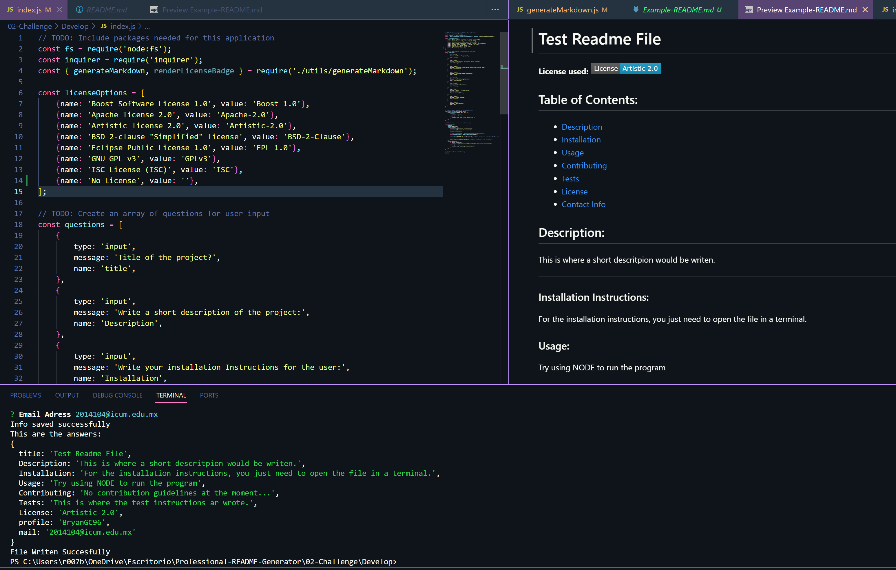

# Professional-README-Generator
### ReadMe file generator using "Node index" command in the terminal.

This project was created to help programmers generate a "proper" README file, by using inquirer / node.
The application will be asking diferent questions to add in the README file, and the user just need to answer them properlly with the content they want.

To run the project, the user must open the project inside a terminal and use "node index" command; after doing this, the terminal will start asking the questions, and
at the end of it, the file will be automatically generated.

*Example of the project running:*

Made by: https://github.com/BryanGC96

Link to the video example: https://drive.google.com/file/d/19AjZQc81J9obZuHdiwrkNrXl1LrPD4Cg/view?usp=sharing

